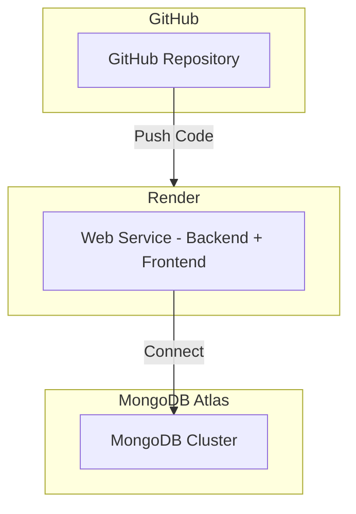

# TenantFlow Render Deployment Plan

## Architecture Overview



## Deployment Strategy: Single Service (Backend serves Frontend)

The backend Express server will serve the React production build in addition to API routes. This simplifies deployment to a single Render Web Service.

## Task Breakdown

### 1. Create .gitignore File
**File:** [`.gitignore`](../.gitignore)
- Prevent committing node_modules, build artifacts, environment files, etc.
- Include standard Node.js ignores + custom entries for this project

### 2. Create Render Configuration
**File:** [`render.yaml`](render.yaml)
- Define a single web service
- Build command: Install dependencies and build frontend
- Start command: Start the Node.js server
- Environment variables to configure in Render dashboard

### 3. Create Production Environment Template
**File:** [`backend/.env.production`](backend/.env.production)
- Template for required environment variables
- Mark sensitive values as placeholders

### 4. Configure Backend to Serve Frontend Build
**File:** [`backend/server.js`](backend/server.js)
- Add middleware to serve static files from `../frontend/build`
- Add catch-all route for SPA routing (React Router)
- Ensure PORT environment variable is used

### 5. Update Backend package.json
**File:** [`backend/package.json`](backend/package.json)
- Add `build` script to build frontend
- Modify `start` script to build before starting (or rely on Render build)

### 6. Initialize Git Repository
**Commands:**
```bash
git init
git add .
git commit -m "Initial commit: TenantFlow CRM with Render deployment config"
```

### 7. Push to GitHub
**Commands:**
```bash
git remote add origin https://github.com/tenantflow/tenantflow.git
git branch -M main
git push -u origin main
```

### 8. Document Render Deployment Steps
**File:** [`RENDER_DEPLOYMENT.md`](RENDER_DEPLOYMENT.md)
- Step-by-step instructions for Render dashboard configuration
- Environment variable list with descriptions
- Troubleshooting tips

## Environment Variables for Render

| Variable | Required | Description |
|----------|----------|-------------|
| `NODE_ENV` | Yes | Set to `production` |
| `PORT` | Yes | Render provides this automatically |
| `MONGODB_URI` | Yes | MongoDB Atlas connection string |
| `JWT_SECRET` | Yes | Strong secret for JWT signing |
| `FRONTEND_URL` | Yes | Your Render service URL |
| `STRIPE_SECRET_KEY` | No | For billing features |
| `OPENAI_API_KEY` | No | For AI features |
| `CLOUDINARY_*` | No | For file uploads |
| `SMTP_*` | No | For email notifications |

## Render Dashboard Configuration

1. **Create New Web Service**
   - Connect GitHub repository
   - Build Command: `npm install && cd backend && npm install && cd ../frontend && npm install && npm run build`
   - Start Command: `cd backend && npm start`

2. **Environment Variables**
   - Add all required variables in Render dashboard
   - Use secrets for sensitive values

3. **Health Check**
   - Backend has `/health` endpoint ready

## Files to Create/Modify

| Action | File |
|--------|------|
| Create | `.gitignore` |
| Create | `render.yaml` |
| Create | `backend/.env.production` |
| Create | `RENDER_DEPLOYMENT.md` |
| Modify | `backend/server.js` - Add static file serving |
| Modify | `backend/package.json` - Add build script |

## Estimated Effort

This is a straightforward deployment setup. The main work is:
- Configuring Express to serve the frontend build
- Creating the Render configuration file
- Setting up Git and pushing to GitHub
